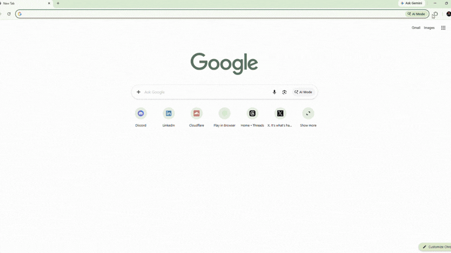

# Threads Prompt Saver

A Chrome extension that saves a Threads post's **images, videos and prompt
text** into a folder you choose, in one click, from the post itself.

It runs inside your normal, already-logged-in Chrome, so private and
followers-only posts work with no separate sign-in. Nothing else needs to be
installed or running.

Each save produces a folder named after the post's prompt:

```
AI_MICRO_STORYBOARD_EDUCATION_GENERATOR_V3.0\
    image1.webp … image10.webp
    video1.mp4  … video6.mp4
    prompt.txt
```

`prompt.txt` holds the post's **master prompt** (the long text behind Threads'
grey *Read more* box) followed by the caption of every post in the author's
thread — so a "1/2 + 2/2" write-up is captured in full.

Saving the same post again reuses its folder and replaces the files, rather
than making a second copy.

## Setup

**1. Load the extension.**

- go to `chrome://extensions`
- turn on **Developer mode** (top right)
- click **Load unpacked** and choose the `extension` folder from this repo



**2. Choose where posts get saved.**

Open the extension's options (its card on `chrome://extensions` →
**Details → Extension options**) and click **Browse…** to pick any folder on
any drive.

Chrome only keeps write permission for the current browser session. After
restarting Chrome, the first save will say so and offer an *Open options*
button; click **Re-allow** there and saving works again for that session. This
is Chrome's rule for folder access and can't be turned off.

**3. Optional — reconstruct prompts that were never published.**

Plenty of posts show off AI-generated images without saying how they were made.
That prompt isn't anywhere on the page, so it can't be recovered — but a vision
model can look at each saved image and write a prompt that would produce
something similar.

Fill in an API base URL, key and vision model in the options page (any
OpenAI-compatible endpoint, e.g. OpenRouter) and posts with no prompt of their
own get a **RECONSTRUCTED PROMPTS** section in `prompt.txt`, marked plainly as a
guess rather than the author's own words. Chrome asks for access to that one
endpoint when you save the settings.

Leave it blank and nothing is sent anywhere and nothing costs money. Filled in,
each image of a promptless post is one API call — an 11-image carousel is 11
calls. Posts that *do* publish a prompt never trigger it.

## Using it

Open any Threads post in Chrome and click **Save post** at the top right of the
page. It reports how many images and videos it saved, and where.

After changing any extension file, hit the reload ↻ button on
`chrome://extensions` — Chrome caches the old code otherwise.

## How it picks the right media

Threads embeds the post's real data as JSON in the page, so the extension reads
the exact media list for the exact post — rather than guessing from the
rendered page or from network traffic. That matters because a naive approach
picks up a video's *poster frame* as if it were an extra photo, and can't tell
the author's carousel from media in the replies.

The folder name comes from the prompt's own title where it has one. Prompts
built from sections instead (`Basic Setting:`, `Characters:` …) have no title,
so the first line of real content is used.

## Notes and limitations

- **Threads posts only.** Other sites aren't supported.
- Media comes from the post in the URL. If an author splits media across a
  "1/2 + 2/2" thread, save each post separately — though the *text* of the
  whole chain is included either way.
- Threads changes its internal page data from time to time. If saving stops
  finding media, that's the most likely cause.
- No AI, no API key and no per-save cost: the prompt text comes from the post
  itself.

## License

[MIT](LICENSE) © wedhalabs

Saved posts belong to whoever wrote them. This licence covers the extension's
own code, not the material you download with it — respect the rights of the
authors whose posts you save.
